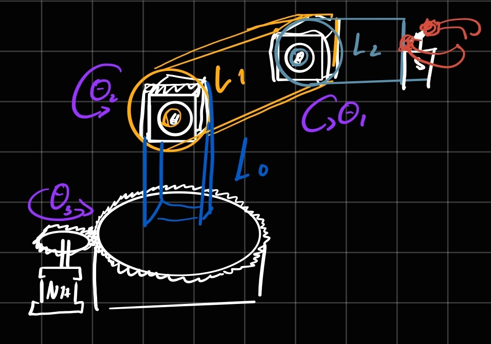
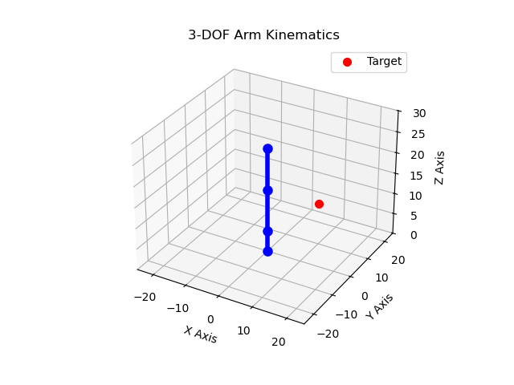
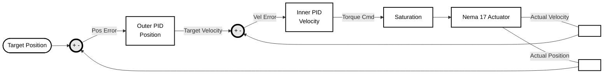
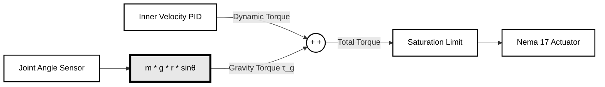

# 3-DOF Articulated Robotic Arm

**Author:** Agustín Torres  
**Background:** Electronics Engineering Student, Universidad de Concepción (UdeC)

**Status:** Active Development (Phase 2: Dynamic simulation)

## Project Overview
This repository documents the design, simulation, and physical construction of a custom 3-DOF (Degrees of Freedom) articulated robotic arm. Built with an RRR (Yaw-Pitch-Pitch) configuration, the mechanical architecture mirrors industry-standard robotic arms used in heavy automation and mining applications. 

The primary focus of this project is the rigorous application of control systems and robotics theory, transitioning from pure mathematical models to dynamic simulations, and finally to embedded hardware deployment.

## Hardware Architecture
* **Microcontroller:** ESP32
* **Actuators:** 3x Nema 17 Stepper Motors (Base, Shoulder, Elbow) + 1x Servomotor MG996R (End-effector/Claw)
* **Drivers:** A4988 
* **Chassis:** 3D printed (PLA)

## Software & Control Pipeline

1.  **Kinematic Prototyping (Python):**
    * Derivation of Forward and Inverse Kinematics (IK) using geometric and algebraic (Denavit-Hartenberg) approaches.
    * Workspace plotting and trajectory generation using NumPy and Matplotlib.
2.  **Dynamic Simulation (Simulink):**
    * Physics simulation incorporating the mass and inertia of the 3D-printed links.
    * Design and mathematical tuning of control loops (PID) to ensure stable motion profiles and prevent motor stalling.
3.  **Hardware Deployment (C++ / ESP32):**
    * Translation of simulated control logic into real-time step generation for the motor drivers.
    * Handling of physical constraints, serial communication, and edge-case safety stops.

## Repository Structure
* `/kinematics` - Python scripts for IK solvers and workspace visualization.
* `/simulation` - Simulink models and control system block diagrams.
* `/firmware` - ESP32 C++ codebase for hardware execution.
* `/cad` - STL files and 3D models for the physical build.

## Future Scope
Once the baseline physical model is operational, planned expansions include exploring Hardware-in-the-Loop (HIL) testing and advanced non-linear control algorithms to further optimize the arm's dynamic response.


# Kinematics 

First, a rough sketch of the arm was drawn to use as a base when writing the kinematic equations. In this sketch $L_0$ $L_1$ and $L_2$ are defined as the lengths of the members for the arm.


From this the forward and inverse kinematics are defined.

### Forward Kinematics
Forward kinematics allow us to determine the precise $(X, Y, Z)$ coordinate of the end effector given the current angles of the three joints $(\theta_1, \theta_2, \theta_3)$. 

By projecting the arm's geometry onto the horizontal plane and calculating the vertical offsets, we define the position as:

$$X = (L_1 \cos(\theta_2) + L_2 \cos(\theta_2 + \theta_3)) \cos(\theta_1)$$
$$Y = (L_1 \cos(\theta_2) + L_2 \cos(\theta_2 + \theta_3)) \sin(\theta_1)$$
$$Z = L_0 + L_1 \sin(\theta_2) + L_2 \sin(\theta_2 + \theta_3)$$

---

### Inverse Kinematics
Inverse kinematics calculate the required joint angles $(\theta_1, \theta_2, \theta_3)$ needed to reach a specific target coordinate $(X, Y, Z)$. 

**1. Base Rotation ($\theta_1$)**
The base angle is calculated by isolating the $X$ and $Y$ coordinates on the horizontal plane:
$$\theta_1 = \text{atan2}(Y, X)$$

**2. 2D Plane Mapping**
To solve for the shoulder and elbow, we map the 3D target into a 2D side-view plane. We calculate the horizontal distance ($r$), adjust for the base height ($Z_{offset}$), and find the direct line-of-sight distance from the shoulder to the target ($D$):

$$r = \sqrt{X^2 + Y^2}$$

$$Z_{offset} = Z - L_0$$

$$D = \sqrt{r^2 + Z_{offset}^2}$$

**3. Shoulder Angle ($\theta_2$)**
The shoulder angle requires finding the angle of elevation to the target ($\alpha$) and the internal angle of the arm's geometry using the Law of Cosines ($\beta$). We use the standard "Elbow Up" configuration to keep the arm clear of the workspace:

$$\alpha = \text{atan2}(Z_{offset}, r)$$

$$\beta = \arccos\left(\frac{L_1^2 + D^2 - L_2^2}{2 L_1 D}\right)$$

$$\theta_2 = \alpha + \beta$$

**4. Elbow Angle ($\theta_3$)**
The elbow angle is derived by finding the internal angle ($\gamma$) using the Law of Cosines. To get the physical motor angle relative to the extended bicep, we subtract the internal angle from 

$180^\circ$ ($\pi$ radians):

$$\gamma = \arccos\left(\frac{L_1^2 + L_2^2 - D^2}{2 L_1 L_2}\right)$$

$$\theta_3 = -(\pi - \gamma)$$

### Python simulation

Once the kinematics were properly defined, using a python script it is possible to check if the equations previously mentioned result in the arm reaching the desired target. In this gif obtained using the *ik.py* script the trajectory mapped by the IK (inverse kinematics) is shown.



This script is available in [kinematics/code/](kinematics/code/)
### How to run the simulation

```
git clone https://github.com/aguscsc/Robot-arm-nema17
cd Robot-arm-nema17/kinematics/code
python ik.py
```
You'll be prompted for the coordinates of the target in this format
```
$ python ik.py 
do you want to record the movement? Y(1) / N(0) 0
Insert target coordinates (x y z separated by spaces): 10 10 10
```
If you choose to record the movement to the target provided a *.gif* file with the name **ik_simulation.gif** will be created

---
# Dynamics Simulation & Control Architecture

## Motor Characterization & Torque Definition
To ensure the digital twin accurately reflects the physical limitations of the hardware, the system's mass and actuation constraints were strictly defined prior to control implementation. 

The manipulator's structural links were modeled using a PLA infill density of **1240 kg/m³** to calculate realistic inertia matrices and centers of gravity. The joints are driven by Nema 17 stepper motors (dimensions: **42.2 x 42.2 x 34 mm**, mass: **0.22 kg**). Crucially, a hard torque saturation limit of **±0.28 Nm** was applied to the digital actuators. This boundary prevents the mathematical controller from demanding infinite instantaneous acceleration, ensuring the simulated control effort remains within the physical stall limits of the stepper motors.

## Static & Dynamic Torque Calculations
To mathematically prove the Nema 17 motors ($\tau_{max} = 0.28\text{ Nm}$) are capable of actuating the manipulator, the worst-case holding torques were calculated. The worst-case scenario occurs when the arm is fully extended horizontally ($\theta = 90^\circ$), maximizing the perpendicular lever arm of gravity.

Using the PLA density (**1240 kg/m³**) to extract the mass of each CAD link, the required torque for each joint was derived using standard static equilibrium equations.

### Base Joint 
As the base joint only rotates perpendicularly to gravity, its torque is defined only by the total inertia of the arm.
$$I = \sum (m_i \cdot r_i^2)$$

Expanding this for the fully extended manipulator yields the total moment of inertia:

$$I_{total} = I_{L1} + I_{motor} + I_{L2} + I_{claw}$$

Substituting the distributed masses and their respective centers of gravity ($r$):
* **$I_{L1}$ (Upper Arm):** $0.1558 \cdot 0.05^2 = 0.00039\text{ kg}\cdot\text{m}^2$
* **$I_{motor}$ (Elbow Actuator):** $0.22 \cdot 0.1^2 = 0.00220\text{ kg}\cdot\text{m}^2$
* **$I_{L2}$ (Forearm):** $0.1558 \cdot 0.15^2 = 0.00351\text{ kg}\cdot\text{m}^2$
* **$I_{claw}$ (End Effector):** $0.105 \cdot 0.2^2 = 0.00420\text{ kg}\cdot\text{m}^2$

$$I_{total} = 0.0103\text{ kg}\cdot\text{m}^2$$

Finally, aiming for $3rads/s^2$, it is possible to determine the torque needed as:

$$\tau = 0.0103*3 = 0.0309Nm$$

Therefore the $0.28Nm$ provided by the motor are enough, the base will be designed with a 1:1 gear ratio in mind.

### Shoulder Joint
The shoulder joint is responsible for fighting gravity with the arm's entire weight, the torque needed can be represented as the sum of all the torques present in the arm.

$$\tau_{total} = \tau_{L1} + \tau_{motor} + \tau_{L2} + \tau_{claw}$$

Substituting the distributed masses and their respective centers of gravity ($r$):
* **$\tau_{L1}$ (Upper Arm):** $0.1558 \cdot 0.05 \cdot 9.8 = 0.076Nm$
* **$\tau_{motor}$ (Elbow Actuator):** $0.22 \cdot 0.1 \cdot 9.8 = 0.216Nm$
* **$\tau_{L2}$ (Forearm):** $0.1558 \cdot 0.15 \cdot 9.8 = 0.0.229Nm$
* **$\tau_{claw}$ (End Effector):** $0.105 \cdot 0.2 \cdot 9.8 = 0.206$

Finally: 
$$\tau_{total} = 0.727Nm$$

As the torque provide by the motors isn't enough to lift the whole arm, the shoulder joint will be designed with a 4:1 gear ratio, providing up to $1.12Nm$

### Elbow joint

For the elbow, the same approach shown for the shoulder joint can be applied, using the next expression:

$$\tau_{total} = \tau_{L2} + \tau_{claw} = 0.435$$

Finally, the elbow joint will be designed with a 2:1 gear ratio in mind


## Cascade Control Architecture Implementation
A dual-loop Cascade PID control architecture was implemented to manage the complex dynamics of the manipulator. Standard single-loop PID controllers are insufficient for physical robotics because they attempt to control position and torque simultaneously, leading to instability. 

The cascade structure separates the logic: an outer Position Loop (the kinematic controller) calculates the trajectory error and outputs a target velocity, while an inner Velocity Loop (the dynamic actuator) drives the hardware to match that speed. This architecture adheres to the principle of bandwidth separation, ensuring the inner loop's response time is significantly faster than the outer loop, preventing motor saturation and tracking lag.



## Active Gravity Compensation (Non-Linear Feedforward)
Standard PID controllers are linear equations, making them inherently poorly suited to fight the non-linear, position-dependent force of gravity. To resolve this, an active gravity compensation loop was introduced via Feedback Linearization. 

The system continuously polls the physical angle of the shoulder and elbow joints and calculates the required holding torque using the following relationship:

$$\tau_g = m \cdot g \cdot r_{cg} \cdot \sin(\theta)$$

This calculated torque is injected as a non-linear feedforward perturbation directly into the motor signal, bypassing the PID loops entirely. By actively cancelling out the static weight of the links in real-time, the arm is rendered mathematically "weightless." The PID controllers are therefore freed to only manage the system's inertia and dynamic movement, drastically improving trajectory precision.



## Baseline Tuning via Isolated Step Response (TODO)

---
