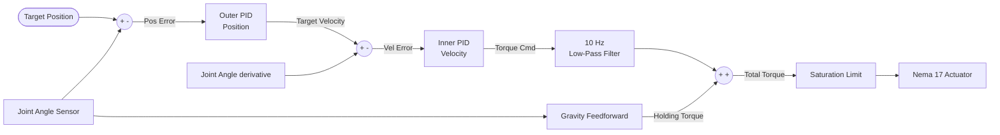
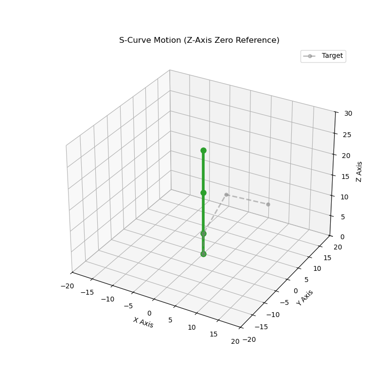

# 3-DOF Articulated Robotic Arm: Digital Twin & Control Architecture

**Author:** Agustín Torres  
**Background:** Electronics Engineering Student, Universidad de Concepción (UdeC)  
**Status:** Active Development (Phase 2: Dynamic Simulation & Trajectory Planning)

## Project Overview

This repository documents the design, digital twin simulation, and embedded hardware deployment of a 3-DOF (Degrees of Freedom) RRR articulated robotic manipulator.

Designed with the strict requirements of heavy industrial automation and autonomous material handling in mind, the primary focus of this project is the rigorous application of modern control systems theory. By validating kinematics and actuator dynamics in a simulated environment first, the architecture guarantees safe, predictable motion profiles and strict adherence to physical hardware constraints before code is ever flashed to the microcontroller.


> 📄 **Deep Dive:** For full equation derivations, payload torque characterizations, and detailed PID tuning methodology, please reference the **[Technical Engineering Report](docs/arm.md)**.

## Core Tech Stack

  * **Simulation & Math:** Python (NumPy, Matplotlib), MATLAB/Simulink
  * **Firmware & Control:** C++ (ESP32 FSM architecture)
  * **Actuation:** Nema 17 Stepper Motors (Base 1:1, Shoulder 4:1, Elbow 2:1), MG996R Servomotor
  * **Drivers & Hardware:** A4988, Custom 3D-Printed PLA Chassis

## Control Architecture

The system utilizes a dual-loop Cascade PID architecture combined with Active Gravity Feedforward.
Instead of controlling torque and position simultaneously (which causes instability), the Outer Loop calculates spatial trajectory errors, while the Inner Loop drives the hardware to match the required velocity.

  * **Gravity Compensation:** A non-linear feedforward loop calculates joint weight in real-time and injects holding torque directly to the motor, rendering the arm mathematically "weightless" so the PI loops only handle dynamic movement.
  * **Signal Conditioning:** A 10 Hz First-Order Low-Pass filter sits between the controller and the actuator to swallow high-frequency numerical chatter, preventing driver burnout and PLA gear shearing.
  * **Asymmetrical Tuning:** The controller gains are tuned specifically to the varying inertial loads and mechanical gear reductions of each joint.

<!-- end list -->



## Repository Structure

  * `/kinematics` - Python scripts for IK solvers, S-curve trajectory generation, and workspace visualization.
  * `/simulation` - Simulink models and control system block diagrams.
  * `/firmware` - ESP32 C++ codebase, FSM, and hardware execution.
  * `/cad` - STL files and 3D models for the physical build.
  * `/docs` - Detailed engineering reports and mathematical derivations.

## How to Run the Kinematic Simulation

```bash
git clone https://github.com/aguscsc/Robot-arm-nema17
cd Robot-arm-nema17/kinematics/code
python ik.py
```

You will be prompted for recording option and target coordinates `(X Y Z)`. The script will validate the workspace and generate a trajectory visualization (if you choose to) `ik_simulation.gif`.

### S curve
To avoid jerking during movement, a quintic polinomial approach was used to control initial and ending position, speed and acceleration.

<p float="left">


</p>

This is also avaliable at [kinematics/code](kinematics/code)

### Robot routines 
Using the scripts [routine_maker.py and s_curve.py](kinematics/code), the user can program routines with the desired points and velocity. The robot has 3 speed profiles: slow (0.5 rad/s), medium (2 rad/s) and fast (3 rad/s)

```
python routine_maker.py
How many points should the robot hit: "The number of points inside the routine"
Point 1 - Insert (x y z) and speed (1=Slow, 2=Med, 3=Fast): "x y z speed"
Calculating trajectory to (10.0, 10.0, 10.0) at Mode "the speed you specified"...
Target Validated! Final Motor Angles: [ \theta_1 \theta_2 \theta_3 ]°
Motion time: "time" seconds

[SUCCESS] Full routine generated! Total waypoints: "Total waypoints of your routine"
Do you want to save the routine for Simulink (.mat)? Y(1) / N(0): 
Do you want to record the movement to a GIF? Y(1) / N(0): 
```

---
## Development Roadmap

1.  **Kinematic Prototyping (Python):**
    * Derivation of Forward and Inverse Kinematics (IK) using geometric and algebraic (Denavit-Hartenberg) approaches.
    * Workspace plotting and trajectory generation using NumPy and Matplotlib.
2.  **Dynamic Simulation (Simulink):**
    * Physics simulation incorporating the mass and inertia of the 3D-printed links.
    * Design and mathematical tuning of control loops (PID) to ensure stable motion profiles and prevent motor stalling.
3.  **Hardware Deployment (C++ / ESP32):**
    * Translation of simulated control logic into real-time step generation for the motor drivers.
    * Handling of physical constraints, serial communication, and edge-case safety stops.

**Possible future additions**
- Graphical interface to control the robot
- Routine definition via machine learning
-----
